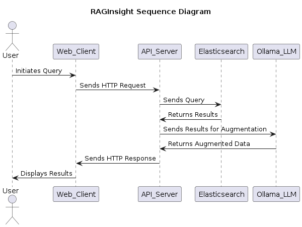

# RAGProject

## Introduction

RAGProject is a project designed to learn about Retrieval-Augmented Generation (RAG) systems and how to integrate them with real-world data. The project includes an example setup using Docker, Elasticsearch, and Ollama LLM, along with some sample documents in the financial, legal, and tech domains.

## Project Structure

```
RAGProject/
├── app
│   ├── __init__.py
│   ├── adapters
│   │   ├── __init__.py
│   │   ├── elasticsearch_adapter.py
│   │   └── llama3_adapter.py
│   ├── config.py
│   ├── core
│   │   ├── __init__.py
│   │   ├── models.py
│   │   └── services.py
│   └── main.py
├── certificates
│   ├── ca-cert.pem
│   ├── ca-cert.srl
│   ├── ca-key.pem
│   └── elasticsearch
│       ├── elasticsearch-cert.pem
│       ├── elasticsearch-key.pem
│       ├── elasticsearch-keystore.jks
│       ├── elasticsearch-keystore.p12
│       ├── elasticsearch-truststore.jks
│       └── elasticsearch.csr
├── docker-compose.yml
├── generate_certs.sh
├── requirements.txt
├── setup-index.sh
└── README.md
```

## Setup and Installation

1. **Clone the Repository**

   ```bash
   git clone https://github.com/PrimeCodeLabs/RAGProject.git
   cd RAGProject
   ```

2. **Generate Certificates**

   ```bash
   ./generate_certs.sh
   ```

3. **Build and Run Docker Containers**

   ```bash
   docker-compose up --build
   ```

4. **Add Sample Documents**
   ```bash
   ./setup-index.sh
   ```

## Querying

To query the system, you can use the provided API endpoints. For example, you can use the following curl command:

```bash
curl -X POST "http://localhost:8000/query" -H "Content-Type: application/json" -d '{"query": "Your query here"}'
```

## Learning Objectives

- Understand the basics of Retrieval-Augmented Generation (RAG).
- Learn how to integrate RAG with real-world data using Elasticsearch and Ollama LLM.
- Gain hands-on experience with Docker and containerized applications.

## Sequence Diagram



## Contributing

If you would like to contribute to this project, please fork the repository and submit a pull request.

## License

This project is licensed under the MIT License - see the [LICENSE](LICENSE) file for details.
